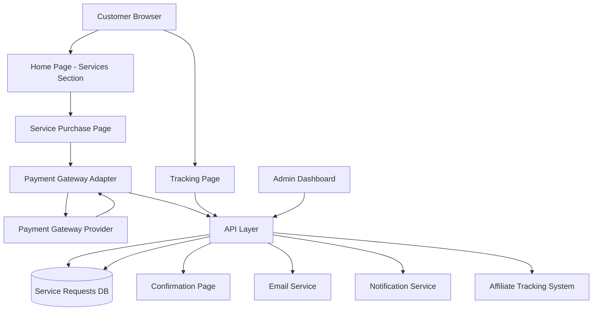

# Service Purchase Flow - Design Document

## Overview

The Service Purchase Flow feature enables customers to directly purchase individual professional services (CA, Legal, etc.) through an integrated payment system. This design implements a complete end-to-end flow from service discovery to payment completion and post-purchase management, while maintaining separation from the existing property inquiry WhatsApp flow.

The system architecture emphasizes:
- Pluggable payment gateway integration for flexibility
- Seamless user experience across devices
- Integration with existing affiliate tracking
- Comprehensive admin management capabilities
- Robust error handling and recovery

## Architecture

### High-Level Architecture



### Component Architecture

The system follows a layered architecture:

1. **Presentation Layer**: React components for UI
2. **API Layer**: Cloudflare Functions for serverless endpoints
3. **Business Logic Layer**: Service modules for payment, notifications, and request management
4. **Data Layer**: D1 database for persistence
5. **Integration Layer**: Adapters for payment gateways, email, and external services

## Components and Interfaces

### 1. Frontend Components

#### ServicesSection Component
```typescript
interface ServicesSectionProps {
  services: Service[];
}

interface Service {
  id: string;
  name: string;
  description: string;
  shortDescription: string;
  pricing: ServicePricing;
  features: string[];
  category: 'ca' | 'legal' | 'other';
}

interface ServicePricing {
  amount: number;
  currency: string;
  tiers?: ServiceTier[];
}

interface ServiceTier {
  name: string;
  amount: number;
  features: string[];
}
```

Responsibilities:
- Display available services on home page
- Render service cards with pricing and features
- Handle "Buy Now" button clicks
- Track service selection analytics

#### ServicePurchaseForm Component
```typescript
interface ServicePurchaseFormProps {
  service: Service;
  onSubmit: (data: PurchaseFormData) => Promise<void>;
  affiliateCode?: string;
}

interface PurchaseFormData {
  fullName: string;
  email: string;
  phone: string;
  requirements: string;
  serviceId: string;
  serviceTierId?: string;
}
```

Responsibilities:
- Collect customer information
- Validate form inputs in real-time
- Display service details
- Handle form submission
- Preserve affiliate tracking parameters

#### PaymentButton Component
```typescript
interface PaymentButtonProps {
  amount: number;
  currency: string;
  customerData: PurchaseFormData;
  onSuccess: (paymentResult: PaymentResult) => void;
  onError: (error: PaymentError) => void;
  disabled: boolean;
}

interface PaymentResult {
  transactionId: string;
  paymentGateway: string;
  amount: number;
  currency: string;
  timestamp: string;
}
```

Responsibilities:
- Initiate payment gateway flow
- Handle payment callbacks
- Display loading states
- Handle payment errors

#### ConfirmationPage Component
```typescript
interface ConfirmationPageProps {
  serviceRequest: ServiceRequest;
}

interface ServiceRequest {
  id: string;
  referenceNumber: string;
  service: Service;
  customer: CustomerInfo;
  payment: PaymentInfo;
  status: ServiceRequestStatus;
  createdAt: string;
}

type ServiceRequestStatus = 
  | 'payment_confirmed'
  | 'pending_contact'
  | 'team_assigned'
  | 'in_progress'
  | 'completed'
  | 'cancelled';
```

Responsibilities:
- Display success message
- Show order reference number
- Provide next steps information
- Offer receipt download
- Track confirmation page view

#### ServiceTrackingPage Component
```typescript
interface ServiceTrackingPageProps {
  referenceNumber?: string;
}

interface ServiceRequestStatus {
  request: ServiceRequest;
  timeline: StatusTimeline[];
  estimatedNextStep: string;
}

interface StatusTimeline {
  status: ServiceRequestStatus;
  timestamp: string;
  description: string;
}
```

Responsibilities:
- Accept reference number input
- Display current status
- Show status timeline
- Provide estimated next steps

#### AdminServiceRequestsTable Component
```typescript
interface AdminServiceRequestsTableProps {
  requests: ServiceRequest[];
  onStatusUpdate: (id: string, status: ServiceRequestStatus) => Promise<void>;
  onAssignProvider: (id: string, providerId: string) => Promise<void>;
  filters: ServiceRequestFilters;
  onFilterChange: (filters: ServiceRequestFilters) => void;
}

interface ServiceRequestFilters {
  serviceType?: string;
  status?: ServiceRequestStatus;
  dateRange?: { start: Date; end: Date };
  assignedProvider?: string;
}
```

Responsibilities:
- Display all service requests
- Support filtering and sorting
- Enable status updates
- Show customer details
- Assign service providers

### 2. API Endpoints

#### POST /api/services/purchase
```typescript
interface PurchaseRequest {
  serviceId: string;
  serviceTierId?: string;
  customer: {
    fullName: string;
    email: string;
    phone: string;
    requirements: string;
  };
  affiliateCode?: string;
}

interface PurchaseResponse {
  requestId: string;
  paymentIntent: PaymentIntent;
}

interface PaymentIntent {
  clientSecret: string;
  amount: number;
  currency: string;
  gateway: string;
}
```

#### POST /api/services/payment/webhook
```typescript
interface PaymentWebhookPayload {
  gateway: string;
  event: string;
  data: any; // Gateway-specific payload
  signature: string;
}

interface WebhookResponse {
  received: boolean;
  processed: boolean;
}
```

#### GET /api/services/requests/:referenceNumber
```typescript
interface TrackingResponse {
  request: ServiceRequest;
  timeline: StatusTimeline[];
  estimatedNextStep: string;
}
```

#### GET /api/admin/services/requests
```typescript
interface AdminRequestsQuery {
  serviceType?: string;
  status?: ServiceRequestStatus;
  startDate?: string;
  endDate?: string;
  assignedProvider?: string;
  page?: number;
  limit?: number;
}

interface AdminRequestsResponse {
  requests: ServiceRequest[];
  total: number;
  page: number;
  totalPages: number;
}
```

#### PATCH /api/admin/services/requests/:id
```typescript
interface UpdateRequestBody {
  status?: ServiceRequestStatus;
  assignedProviderId?: string;
  notes?: string;
}

interface UpdateRequestResponse {
  request: ServiceRequest;
  updated: boolean;
}
```

### 3. Payment Gateway Adapter

The payment gateway adapter provides a pluggable architecture for multiple payment providers.

```typescript
interface PaymentGatewayAdapter {
  createPaymentIntent(params: PaymentIntentParams): Promise<PaymentIntent>;
  verifyWebhook(payload: any, signature: string): boolean;
  processWebhook(payload: any): Promise<PaymentWebhookResult>;
  refund(transactionId: string, amount?: number): Promise<RefundResult>;
}

interface PaymentIntentParams {
  amount: number;
  currency: string;
  customerEmail: string;
  customerName: string;
  description: string;
  metadata: Record<string, string>;
}

interface PaymentWebhookResult {
  transactionId: string;
  status: 'success' | 'failed' | 'pending';
  amount: number;
  currency: string;
  metadata: Record<string, string>;
}

interface RefundResult {
  refundId: string;
  amount: number;
  status: 'success' | 'failed' | 'pending';
}
```

#### Payment Gateway Factory
```typescript
interface PaymentGatewayConfig {
  provider: 'razorpay' | 'stripe' | 'paypal';
  apiKey: string;
  apiSecret: string;
  webhookSecret: string;
  mode: 'test' | 'live';
}

class PaymentGatewayFactory {
  static create(config: PaymentGatewayConfig): PaymentGatewayAdapter {
    switch (config.provider) {
      case 'razorpay':
        return new RazorpayAdapter(config);
      case 'stripe':
        return new StripeAdapter(config);
      case 'paypal':
        return new PayPalAdapter(config);
      default:
        throw new Error(`Unsupported payment gateway: ${config.provider}`);
    }
  }
}
```

### 4. Email Service

```typescript
interface EmailService {
  sendConfirmationEmail(params: ConfirmationEmailParams): Promise<EmailResult>;
  sendProviderNotification(params: ProviderNotificationParams): Promise<EmailResult>;
  sendStatusUpdateEmail(params: StatusUpdateEmailParams): Promise<EmailResult>;
}

interface ConfirmationEmailParams {
  to: string;
  customerName: string;
  referenceNumber: string;
  service: Service;
  amount: number;
  currency: string;
  estimatedContact: string;
}

interface ProviderNotificationParams {
  to: string;
  providerName: string;
  request: ServiceRequest;
}

interface StatusUpdateEmailParams {
  to: string;
  customerName: string;
  referenceNumber: string;
  oldStatus: ServiceRequestStatus;
  newStatus: ServiceRequestStatus;
  message: string;
}

interface EmailResult {
  sent: boolean;
  messageId?: string;
  error?: string;
}
```

### 5. Notification Service

```typescript
interface NotificationService {
  notifyProvider(request: ServiceRequest): Promise<void>;
  notifyAdmin(request: ServiceRequest): Promise<void>;
  notifyCustomer(request: ServiceRequest, event: NotificationEvent): Promise<void>;
}

type NotificationEvent = 
  | 'payment_confirmed'
  | 'team_assigned'
  | 'status_updated'
  | 'completed';
```

## Data Models

### Services Table
```sql
CREATE TABLE services (
  id TEXT PRIMARY KEY,
  name TEXT NOT NULL,
  description TEXT NOT NULL,
  short_description TEXT NOT NULL,
  category TEXT NOT NULL CHECK(category IN ('ca', 'legal', 'other')),
  base_price REAL NOT NULL,
  currency TEXT NOT NULL DEFAULT 'INR',
  features TEXT NOT NULL, -- JSON array
  is_active INTEGER NOT NULL DEFAULT 1,
  created_at TEXT NOT NULL DEFAULT CURRENT_TIMESTAMP,
  updated_at TEXT NOT NULL DEFAULT CURRENT_TIMESTAMP
);
```

### Service Tiers Table
```sql
CREATE TABLE service_tiers (
  id TEXT PRIMARY KEY,
  service_id TEXT NOT NULL,
  name TEXT NOT NULL,
  price REAL NOT NULL,
  features TEXT NOT NULL, -- JSON array
  sort_order INTEGER NOT NULL DEFAULT 0,
  is_active INTEGER NOT NULL DEFAULT 1,
  created_at TEXT NOT NULL DEFAULT CURRENT_TIMESTAMP,
  FOREIGN KEY (service_id) REFERENCES services(id) ON DELETE CASCADE
);
```

### Service Requests Table
```sql
CREATE TABLE service_requests (
  id TEXT PRIMARY KEY,
  reference_number TEXT NOT NULL UNIQUE,
  service_id TEXT NOT NULL,
  service_tier_id TEXT,
  
  -- Customer Information
  customer_name TEXT NOT NULL,
  customer_email TEXT NOT NULL,
  customer_phone TEXT NOT NULL,
  customer_requirements TEXT NOT NULL,
  
  -- Payment Information
  payment_transaction_id TEXT,
  payment_gateway TEXT NOT NULL,
  payment_amount REAL NOT NULL,
  payment_currency TEXT NOT NULL DEFAULT 'INR',
  payment_status TEXT NOT NULL CHECK(payment_status IN ('pending', 'completed', 'failed', 'refunded')),
  payment_completed_at TEXT,
  
  -- Request Status
  status TEXT NOT NULL DEFAULT 'pending_contact' CHECK(status IN (
    'payment_confirmed',
    'pending_contact',
    'team_assigned',
    'in_progress',
    'completed',
    'cancelled'
  )),
  assigned_provider_id TEXT,
  
  -- Affiliate Tracking
  affiliate_code TEXT,
  affiliate_id TEXT,
  
  -- Metadata
  notes TEXT,
  created_at TEXT NOT NULL DEFAULT CURRENT_TIMESTAMP,
  updated_at TEXT NOT NULL DEFAULT CURRENT_TIMESTAMP,
  
  FOREIGN KEY (service_id) REFERENCES services(id),
  FOREIGN KEY (service_tier_id) REFERENCES service_tiers(id),
  FOREIGN KEY (assigned_provider_id) REFERENCES users(id),
  FOREIGN KEY (affiliate_id) REFERENCES users(id)
);

CREATE INDEX idx_service_requests_reference ON service_requests(reference_number);
CREATE INDEX idx_service_requests_status ON service_requests(status);
CREATE INDEX idx_service_requests_customer_email ON service_requests(customer_email);
CREATE INDEX idx_service_requests_affiliate ON service_requests(affiliate_id);
CREATE INDEX idx_service_requests_created ON service_requests(created_at);
```

### Service Request Status History Table
```sql
CREATE TABLE service_request_status_history (
  id TEXT PRIMARY KEY,
  service_request_id TEXT NOT NULL,
  old_status TEXT,
  new_status TEXT NOT NULL,
  changed_by_user_id TEXT,
  notes TEXT,
  created_at TEXT NOT NULL DEFAULT CURRENT_TIMESTAMP,
  
  FOREIGN KEY (service_request_id) REFERENCES service_requests(id) ON DELETE CASCADE,
  FOREIGN KEY (changed_by_user_id) REFERENCES users(id)
);

CREATE INDEX idx_status_history_request ON service_request_status_history(service_request_id);
```

### Payment Gateway Configuration Table
```sql
CREATE TABLE payment_gateway_config (
  id TEXT PRIMARY KEY,
  provider TEXT NOT NULL UNIQUE CHECK(provider IN ('razorpay', 'stripe', 'paypal')),
  is_active INTEGER NOT NULL DEFAULT 0,
  is_default INTEGER NOT NULL DEFAULT 0,
  api_key_encrypted TEXT NOT NULL,
  api_secret_encrypted TEXT NOT NULL,
  webhook_secret_encrypted TEXT NOT NULL,
  mode TEXT NOT NULL DEFAULT 'test' CHECK(mode IN ('test', 'live')),
  config_json TEXT, -- Additional provider-specific config
  created_at TEXT NOT NULL DEFAULT CURRENT_TIMESTAMP,
  updated_at TEXT NOT NULL DEFAULT CURRENT_TIMESTAMP
);
```

## Correctness Properties

*A property is a characteristic or behavior that should hold true across all valid executions of a system-essentially, a formal statement about what the system should do. Properties serve as the bridge between human-readable specifications and machine-verifiable correctness guarantees.*


### Property 1: Service card completeness
*For any* service, when rendered as a service card, the output SHALL contain the service name, brief description, pricing, and a "Buy Now" button.
**Validates: Requirements 1.2**

### Property 2: Price formatting consistency
*For any* price amount and currency code, the formatted price string SHALL include the currency symbol.
**Validates: Requirements 1.3**

### Property 3: Service tier display completeness
*For any* service with multiple tiers, the rendered output SHALL include all tiers with their respective features and pricing.
**Validates: Requirements 1.4**

### Property 4: Service data preservation through navigation
*For any* service selection, when navigating to the purchase page, the service type and pricing information SHALL be preserved and accessible.
**Validates: Requirements 2.2**

### Property 5: Analytics tracking on service selection
*For any* service selection event, the analytics tracking function SHALL be called with the correct service identifier and event type.
**Validates: Requirements 2.4**

### Property 6: Form validation correctness
*For any* input value, the validation function SHALL return the correct validation result (valid/invalid) based on the field type (email, phone, required field).
**Validates: Requirements 3.2**

### Property 7: Error message generation for incomplete forms
*For any* incomplete form submission, error messages SHALL be generated for all missing required fields.
**Validates: Requirements 3.3**

### Property 8: Payment button state based on form validity
*For any* form state, the payment button SHALL be enabled if and only if all form fields are valid.
**Validates: Requirements 3.5**

### Property 9: Payment intent data accuracy
*For any* payment initiation, the data passed to the payment gateway SHALL match the selected service amount, name, and customer details.
**Validates: Requirements 4.2**

### Property 10: Payment gateway adapter interface compliance
*For any* payment gateway implementation, it SHALL satisfy the PaymentGatewayAdapter interface contract, allowing interchangeable use.
**Validates: Requirements 4.6**

### Property 11: Confirmation page content completeness
*For any* successful service request, the confirmation page SHALL display a success message, unique reference number, and service details.
**Validates: Requirements 5.2**

### Property 12: Confirmation email sending
*For any* successful payment, the email service SHALL be invoked with the customer's email address and order details.
**Validates: Requirements 6.1**

### Property 13: Confirmation email content completeness
*For any* confirmation email, the email content SHALL include the reference number, service details, amount paid, and next steps.
**Validates: Requirements 6.2**

### Property 14: Email retry mechanism
*For any* email delivery failure, the system SHALL retry sending up to 3 times with exponential backoff delays.
**Validates: Requirements 6.4**

### Property 15: Service request database persistence
*For any* successful payment, a service request record SHALL be created in the database with all required fields populated.
**Validates: Requirements 7.1**

### Property 16: Provider notification on request creation
*For any* service request creation, a notification SHALL be sent to the assigned service provider or admin team.
**Validates: Requirements 7.2**

### Property 17: Provider notification content completeness
*For any* provider notification, the notification SHALL include customer details, service type, requirements, and payment confirmation.
**Validates: Requirements 7.3**

### Property 18: Service provider routing
*For any* service request with multiple available providers, the system SHALL select a provider based on the defined availability or assignment rules.
**Validates: Requirements 7.4**

### Property 19: Initial service request status
*For any* newly created service request, the initial status SHALL be set to "pending_contact".
**Validates: Requirements 7.5**

### Property 20: Admin dashboard service request display
*For any* service request in the admin view, the display SHALL show customer name, service type, purchase date, status, and assigned provider.
**Validates: Requirements 8.2**

### Property 21: Service request status update persistence
*For any* administrator status update, the database SHALL reflect the new status and an updated timestamp.
**Validates: Requirements 8.4**

### Property 22: Service request filtering
*For any* filter criteria (service type, status, date range, assigned provider), only service requests matching all specified criteria SHALL be returned.
**Validates: Requirements 8.5**

### Property 23: Reference number uniqueness
*For any* two distinct service purchases, the generated reference numbers SHALL be unique.
**Validates: Requirements 9.1**

### Property 24: Tracking page status display
*For any* valid reference number, the tracking page SHALL display the current status of the corresponding service request.
**Validates: Requirements 9.2**

### Property 25: Status label mapping
*For any* service request status value, the system SHALL display the correct human-readable status label.
**Validates: Requirements 9.3**

### Property 26: Status change email notification
*For any* service request status change, an email notification SHALL be sent to the customer.
**Validates: Requirements 9.4**

### Property 27: Next steps display for status
*For any* service request status, the tracking page SHALL display estimated next steps and timeline information.
**Validates: Requirements 9.5**

### Property 28: Affiliate parameter preservation
*For any* purchase flow initiated with affiliate tracking parameters, those parameters SHALL be preserved through all steps until purchase completion.
**Validates: Requirements 10.1**

### Property 29: Affiliate attribution recording
*For any* service purchase with affiliate tracking, the affiliate attribution SHALL be recorded in the service request record.
**Validates: Requirements 10.2**

### Property 30: Affiliate commission calculation trigger
*For any* service purchase with affiliate attribution, the commission calculation function SHALL be invoked with the correct service pricing and affiliate information.
**Validates: Requirements 10.3**

### Property 31: Affiliate metrics inclusion
*For any* affiliate with service purchases, those purchases SHALL be included in the affiliate dashboard metrics.
**Validates: Requirements 10.4**

### Property 32: Affiliate commission adjustment on refund
*For any* service purchase refund with affiliate attribution, the affiliate commission SHALL be adjusted to reflect the refund.
**Validates: Requirements 10.5**

### Property 33: Payment error message display
*For any* payment gateway error, a user-friendly error message with suggested next steps SHALL be displayed to the customer.
**Validates: Requirements 11.1**

### Property 34: Database error handling
*For any* database error during request creation, the error SHALL be logged and a retry option SHALL be displayed to the customer.
**Validates: Requirements 11.2**

### Property 35: Network timeout retry logic
*For any* network timeout, the system SHALL implement automatic retry logic with exponential backoff.
**Validates: Requirements 11.3**

### Property 36: Unexpected error handling
*For any* unexpected error, error details SHALL be captured for debugging and a generic error message SHALL be shown to users.
**Validates: Requirements 11.4**

### Property 37: Error log completeness
*For any* error logged, the log entry SHALL include timestamp, user context, and stack trace.
**Validates: Requirements 11.5**

### Property 38: Mobile form input types
*For any* form field, the HTML input type attribute SHALL match the expected data type (email for email, tel for phone, text for general text).
**Validates: Requirements 12.2**

## Error Handling

### Error Categories and Handling Strategies

#### 1. Payment Gateway Errors
- **Network Errors**: Retry with exponential backoff (3 attempts)
- **Invalid Payment Details**: Display specific validation errors to user
- **Insufficient Funds**: Show clear message with alternative payment options
- **Gateway Timeout**: Implement webhook-based status checking
- **Gateway Unavailable**: Fallback to alternative gateway if configured

#### 2. Database Errors
- **Connection Failures**: Retry with exponential backoff
- **Constraint Violations**: Log error and show user-friendly message
- **Transaction Failures**: Rollback and retry once
- **Query Timeouts**: Log for investigation, show retry option

#### 3. Email Delivery Errors
- **SMTP Failures**: Retry up to 3 times with exponential backoff
- **Invalid Email Address**: Validate before sending, log if validation passed but sending failed
- **Rate Limiting**: Queue for later delivery
- **Template Errors**: Log error, alert administrators

#### 4. Validation Errors
- **Client-Side**: Display inline error messages immediately
- **Server-Side**: Return structured error response with field-specific messages
- **Business Logic**: Clear error messages explaining why action cannot be completed

#### 5. Integration Errors
- **Affiliate System**: Log error but don't block purchase
- **Analytics**: Log error but don't block user flow
- **Notification Service**: Queue for retry, alert if persistent

### Error Response Format
```typescript
interface ErrorResponse {
  error: {
    code: string;
    message: string;
    details?: Record<string, string>;
    retryable: boolean;
    suggestedAction?: string;
  };
}
```

### Error Logging Strategy
- All errors logged with structured format
- Include request ID for tracing
- Capture user context (anonymized)
- Log stack traces for debugging
- Alert on critical errors (payment failures, database issues)

## Testing Strategy

### Unit Testing

Unit tests will verify individual components and functions:

**Frontend Components:**
- Service card rendering with various service configurations
- Form validation logic with valid and invalid inputs
- Payment button state management
- Error message display
- Status label mapping

**Backend Functions:**
- Payment gateway adapter implementations
- Email template generation
- Reference number generation
- Service request creation logic
- Status update logic
- Filtering and querying logic

**Utilities:**
- Price formatting with different currencies
- Date/time formatting
- Validation functions (email, phone)
- Error handling utilities

### Property-Based Testing

Property-based tests will verify universal properties across many inputs using a PBT library (fast-check for TypeScript):

**Configuration:**
- Minimum 100 iterations per property test
- Each test tagged with property number and requirement reference

**Test Categories:**

1. **Data Integrity Properties:**
   - Service data preservation through navigation
   - Affiliate parameter preservation
   - Payment data accuracy

2. **Validation Properties:**
   - Form validation correctness across input types
   - Email format validation
   - Phone number validation

3. **Business Logic Properties:**
   - Commission calculation correctness
   - Status transition validity
   - Provider routing logic

4. **Rendering Properties:**
   - Service card completeness
   - Confirmation page content
   - Email content completeness

5. **Error Handling Properties:**
   - Retry logic execution
   - Error message generation
   - Error logging completeness

### Integration Testing

Integration tests will verify component interactions:

- Complete purchase flow from service selection to confirmation
- Payment gateway webhook processing
- Email sending and retry logic
- Database transaction handling
- Admin dashboard operations
- Tracking page functionality

### End-to-End Testing

E2E tests will verify complete user journeys:

- Customer purchases service successfully
- Customer experiences payment failure and retries
- Admin manages service requests
- Customer tracks service request status
- Affiliate attribution through complete flow

### Testing Tools

- **Unit Tests**: Vitest
- **Property-Based Tests**: fast-check
- **Integration Tests**: Vitest with test database
- **E2E Tests**: Playwright
- **API Tests**: Supertest or similar

## Security Considerations

### Payment Security
- All payment processing through PCI-compliant gateways
- No storage of credit card details
- HTTPS for all payment-related communications
- Webhook signature verification
- Payment intent validation

### Data Protection
- Customer data encrypted at rest
- Sensitive configuration (API keys) encrypted
- Access control for admin functions
- Audit logging for sensitive operations
- GDPR compliance for customer data

### API Security
- Authentication required for admin endpoints
- Rate limiting on public endpoints
- Input validation and sanitization
- SQL injection prevention
- XSS protection

### Session Security
- Secure session management
- CSRF protection
- Session timeout
- Secure cookie flags

## Performance Considerations

### Frontend Performance
- Lazy loading of payment gateway scripts
- Optimized images and assets
- Code splitting for purchase flow
- Caching of service data
- Progressive enhancement

### Backend Performance
- Database query optimization with indexes
- Connection pooling
- Caching of service configurations
- Async processing for emails and notifications
- Rate limiting to prevent abuse

### Scalability
- Stateless API design
- Horizontal scaling capability
- Queue-based email processing
- CDN for static assets
- Database read replicas if needed

## Deployment Strategy

### Database Migrations
1. Create services and service_tiers tables
2. Create service_requests table
3. Create service_request_status_history table
4. Create payment_gateway_config table
5. Add indexes for performance
6. Seed initial service data

### Configuration
- Payment gateway credentials in environment variables
- Email service configuration
- Notification service endpoints
- Feature flags for gradual rollout

### Rollout Plan
1. Deploy database migrations
2. Deploy backend API endpoints
3. Deploy admin dashboard features
4. Deploy frontend purchase flow (behind feature flag)
5. Enable for beta users
6. Monitor metrics and errors
7. Gradual rollout to all users

### Monitoring
- Payment success/failure rates
- Email delivery rates
- API response times
- Error rates by category
- Conversion funnel metrics
- Customer support ticket volume

## Future Enhancements

### Phase 2 Features
- Subscription-based services
- Service bundles and packages
- Customer service request dashboard
- Direct messaging with service providers
- Service provider ratings and reviews
- Automated service provider assignment based on workload

### Phase 3 Features
- Multi-currency support
- International payment methods
- Service marketplace for third-party providers
- Advanced analytics and reporting
- Mobile app integration
- WhatsApp Business API integration for updates
